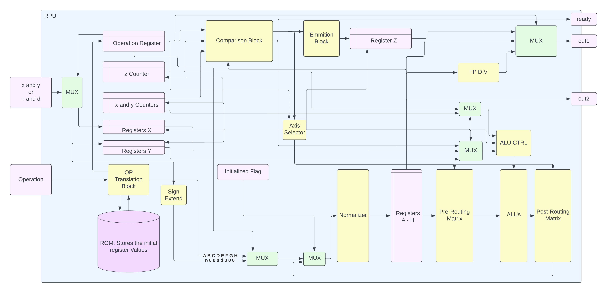

# RPU

    

This repository contains the current HDL version of a Rational Arithmetic Unit based on Binary Continued Logarithms as described in the included [Paper Draft](Hardware_Development_of_a_Rational_Number_Arithmetic_Computation_Unit_Using_Binary_Continued_Logarithms.pdf).

## Abstract
In this project, we developed an Arithmetic Computation Unit for operating on Binary Continued Logarithms (BCLs)
a novel decimal number representation That can represent any
rational number losslessly given a large enough width. The paper
first presents the mathematical theory that allows storing high precision decimal numbers, then it outlines the theory for performing mathematical operations on the type. After presenting
the mathematical theory, the custom type and operations are
implemented in VHDL and a hardware accelerator is built which
is dedicated to performing high-precision decimal arithmetic on
the type.
